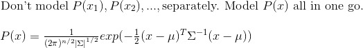

~~~~
title: Linear Regression
authors:
- name: Liping Wu
  email: lipingwu@email.com
summary: linear regression algorithm
publishDate: 01/16/2018
updateDate: 02/16/2018
tags: [supervised, regression]
~~~~

# Linear Regression

Hypothesis Function: 

Test image:

# Test

We measure the similarity of $x$ and $l$ by doing one of $(x^{T}l)^{2}$, $(x^{T}l)^{3}$, $(x^{T}l+1)^{3}$. The general form is $(x^{T}l+constant)^{D}$.

~~~xml
<test>
	<message>hello</message>
</test>
~~~

~~~java
public class test {
	private final String hello = "hello";
	
	public String getHello() {
		return hello;
	}
}
~~~
